# # Proyecto ARSW-2021 LottoWeb

Para la intermediación entre los transportistas y los usuarios mediante una aplicación móvil en Bogotá

## ¿Quiénes Somos?

**LOTTOWEB** busca enlazar usuarios que buscan servicios de mudanzas o acarreos de todo tipo con transportistas que cuentan con vehículos de carga que sastifagan dicha necesidad, logrando a su vez incrementar sus ingresos apartir de actividades por demanda.

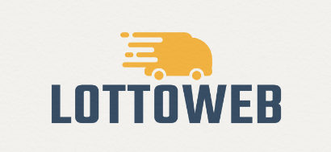

## Objetivos
*  Enlazar personas que buscan una alternativa eficiente, segura y digital desolicitar el transporte de sus mudanzas o acarreos, con transportistas.
*  Permitir a los transportistas generar ingresos por demanda conectandolos con usuarios que soliciten un viaje, actualmente estos servicios sólo los pueden realizar con familiares y conocidos, o en lugares comerciales esperando que usuarios lleguen a ellos (Estos lugares generalmente son de seguridad crítica).
*  solicitar un viaje estableciendo el punto departida, el punto de llegada, y el servicio que desea tomar. Una vez solicitado el servicio será posible cancelarlo antes de que el conductor llegue al punto de partida.
*  Ofrecer funcionalidades de Seguimiento en tiempo real del viaje, Intermerdiacion entre multiples usuarios y conductores, Alta eficacia en los tiempos de atención, Alta efectividad para los conductores de los vehiculos y Seguridad en la operación

## Descripción

* **Login - Registro:**
Los usuarios pueden ingresar a la aplicación y registrarse como conductores o clientes para solicitar un servicio. Una vez ingresen encontraran diferentes funcionalidades de acuerdo a su perfil.

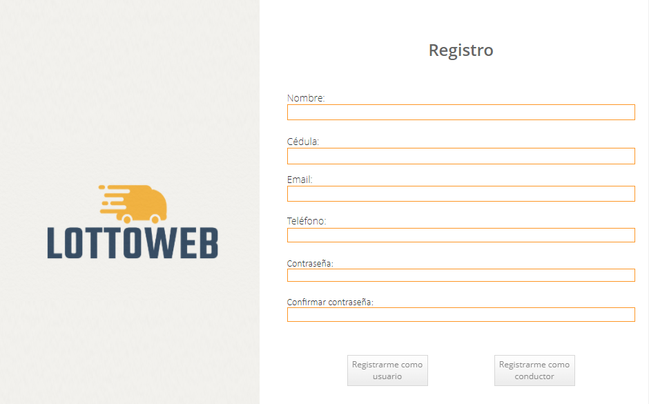

* **Solicitud de un servicio:**
Es posible solicitar un viaje estableciendo el punto de partida, el punto de llegada, y el servicio que desea tomar. Una vez solicitado el servicio será posible cancelarlo antes de que el conductores llegue al punto de partida.

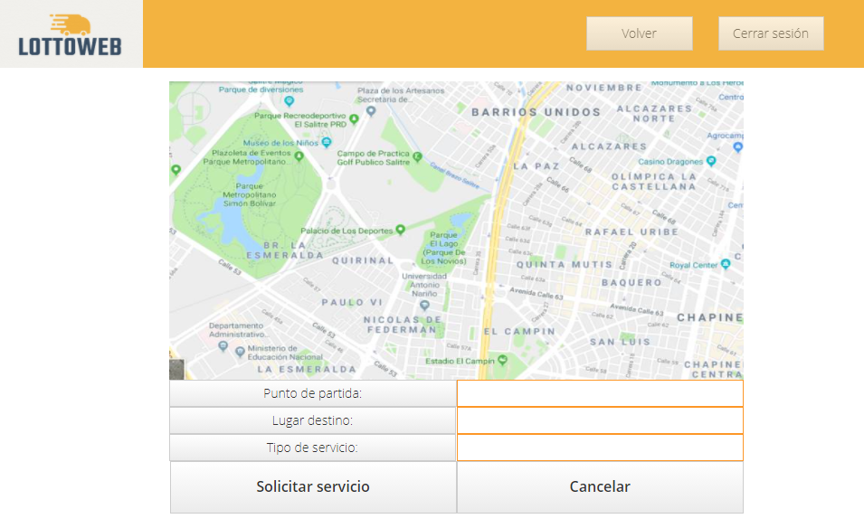

* **Tomar un servicio:**
Una vez se realiza la solicitud de un servicio, los conductores podrán verlo en los viajes disponibles y decidir si desean enviar una oferta. El cliente puede elegir que oferta tomar y una vez seleccionada iniciará el viaje.

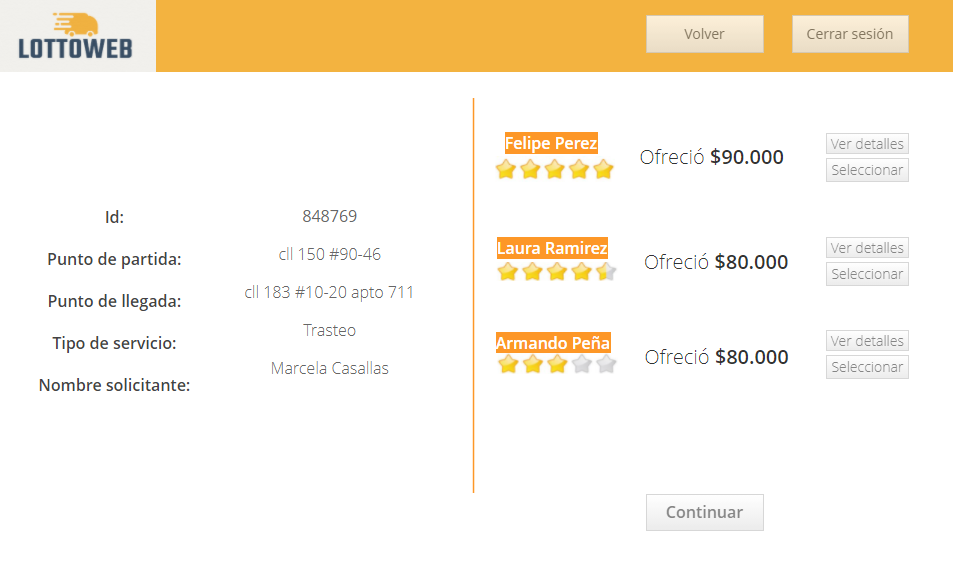

* **Durante y después del viaje:**
Durante el viaje es posible realizar el seguimiento en tiempo real del recorrido. Una vez finalice el viaje los usuario podrán calificar al conductor de acuerdo al servicio prestado.

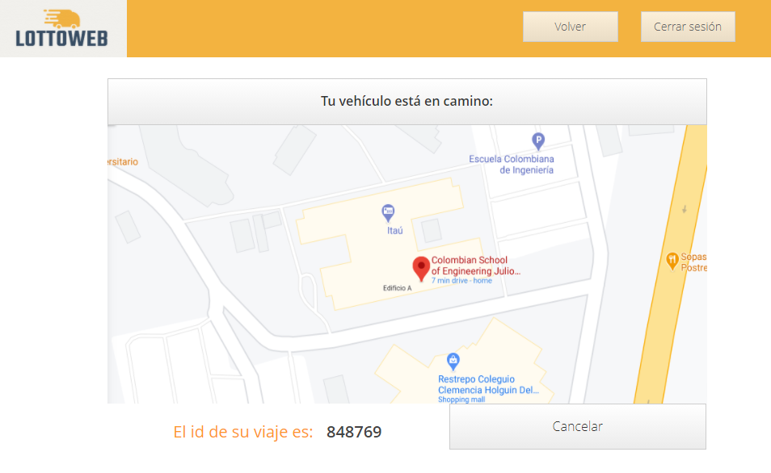

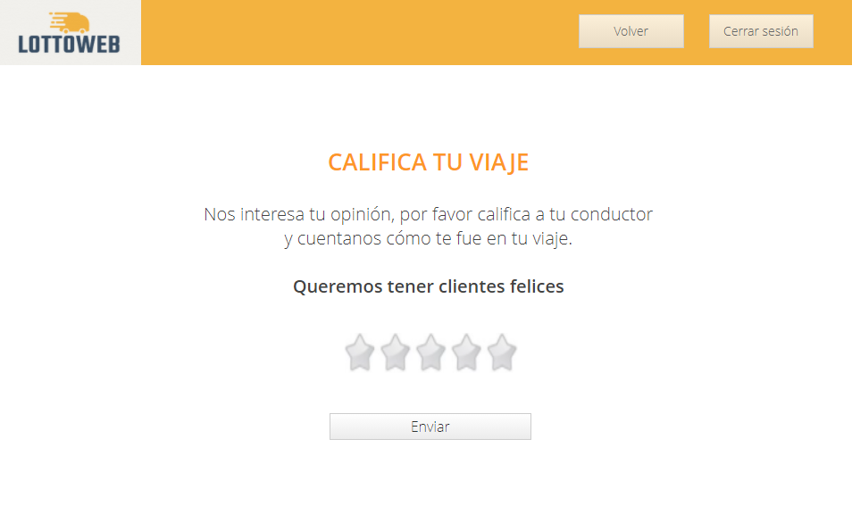

## Diagramas

* **Diagrama de casos de uso:**

* **Diagrama de clases:**

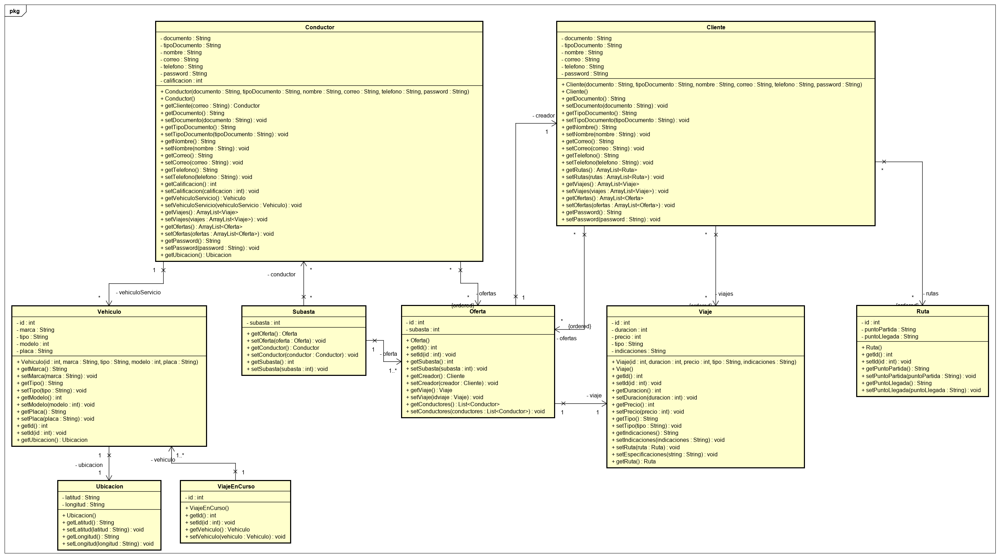

* **Diagrama de componentes:**

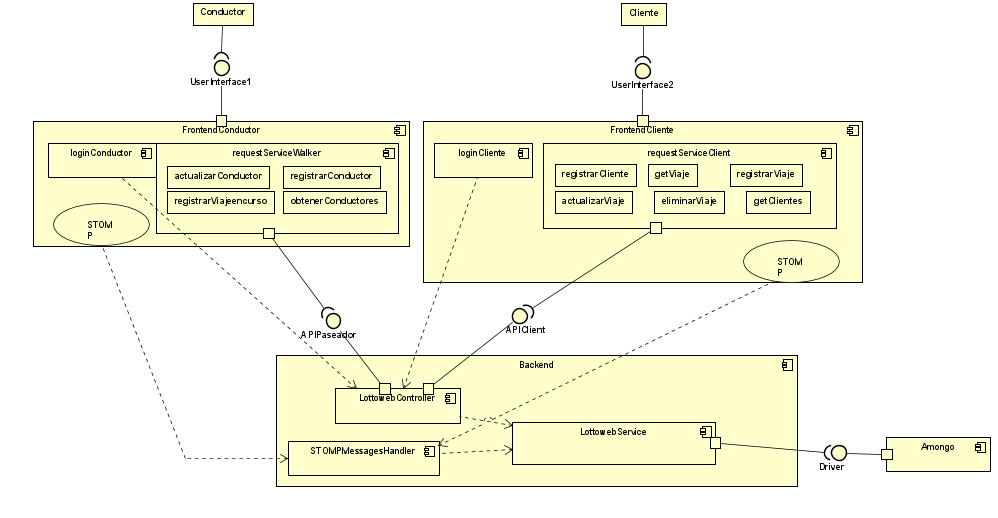

* **Diagrama de Secuencia:** (Algunos)

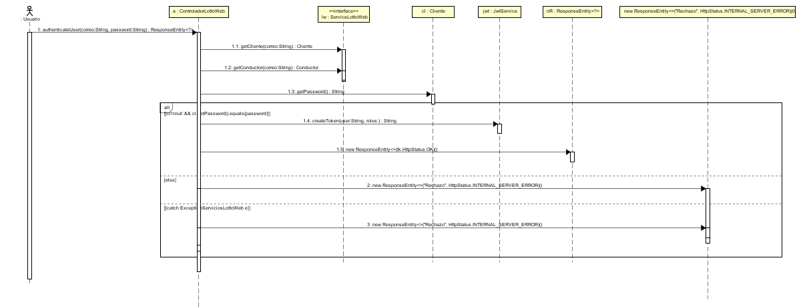

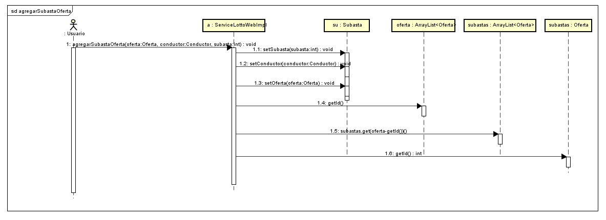

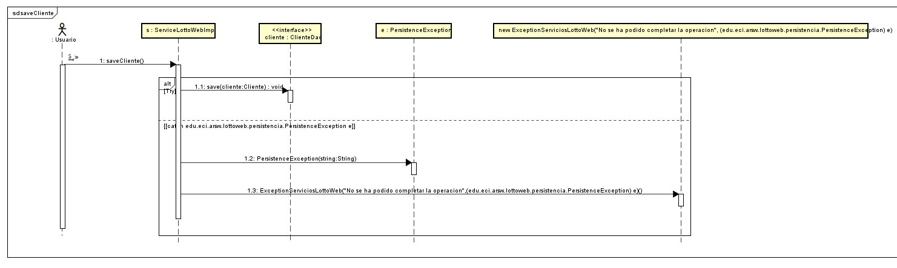

## GitHub

Front:	https://github.com/LottoWebTeam/LottoWebFront.git

Back:	https://github.com/LottoWebTeam/LottoWebBackend.git

Proyecto Completo y Unificado:	https://github.com/LottoWebTeam/ProyectoARSW2021_LottoWeb.git

## Taiga

## Despliegue en Heroku☁️

## Despliegue en CircleCi✔️ 

## Despliegue en Codacy

* **Adriana Marcela Castañeda Velasquez** - [adrianamcv](https://github.com/adrianamcv)
* **Brayan Santiago Buitrago Murillo** - [DonSantiagoS](https://github.com/DonSantiagoS)
* **Guillermo Alfonso Castro Camelo** - [Memo1019](https://github.com/memo1019)

## Licencia

This project is licensed under the GNU v3.0 License - see the [LICENSE](LICENSE.txt) file for details
